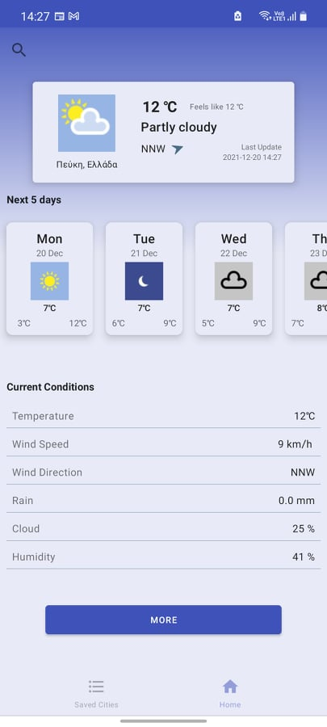

# Weather App

It is an Android weather forecast application which provides the ability to have a
quick overview of the current weather conditions for a selected city or region as well as user is able to select and see the weather for one of the next 5 days.
User is a able to search for worldwide cities and store them as favorites.

Remote datasources, used to collect weather condition details and search for cities, are the APIs provide by [World Weather Online](#https://www.worldweatheronline.com/api/).

   
  

To summarize, this app gives the user the ability to:

* search for cities and store them locally using Android Room
* see a quick overview of the weather forecast for a particular day, including the next 5 days.
* after selecting either the current day or one of the next 5 days, user can have an in detail look over this day's weather forecast. This happens in two ways:
  * a quick summary of the current weather forecast or
  * a detailed overview of the forecast per hour and the details for the selected using a BottomSheet dialog.
* user can see also the forecast for his current location, in case he grants the location permission to the app.
* It is not mandatory when user is searching for a city to store this city locally
  *Note:To achieve this user must not click on the add button provided in the suggestion box, rather clicking in the center of the item.*

##### Next Features

* Provide a periodic task for fetching weather forecast after a certain time interval or when device's location has changed.
* Provide Settings/Preferences screen to customize the next days weather forecast etc.
* Use a map [mapsforge/vtm](https://github.com/mapsforge/vtm) to show saved cities.
  Enable to click on a map and fetching the forecast for this point.
#### Archicteture

This app is build using a MVVM architecture. The guide *Guide to app architecture* found [here](https://developer.android.com/jetpack/guide) is a great source for reading and understanding how to design clean as well as the Android samples provided
[here](https://github.com/android/architecture-components-samples) are a great tool

##### Libraries used/topics covered during the development of this app

* MVVM architecture: Best practices and recommended architecture for building robust high quality apps.
* Layouts: Designed custom Layouts using ConstraintLayout
* DataBinding: Provides us the ability to write the code used to fill UI elements in the xml layout files
* Binding adapters: Are responsible for making the appropriate framework calls to set values
* ViewModel: This class is designed to store and manage UI-related data in a lifecycle conscious way.
* LiveData: An observable, lifecycle-aware data holder class.
* Navigation: Android Jetpack's Navigation component for consistent and predictable user experience.
* Room database: Persistence library that provides an abstraction layer over SQLite.
* Retrofit: A robust HTTP client to manage network requests.
* WorkManager: API to schedule deferrable, asynchronous tasks that are expected to run even if the app is closed.
  Dependency Injection: Using Android Hilt library to implement dependency injection pattern.
* DayNight Theme: Support dark theme for Android 10 (API level 29) and higher.
* Glide: Is a framework for make image loading very fast and simple. Api provided url for the weather icons
* Timber a logger library build on top of Android Log.